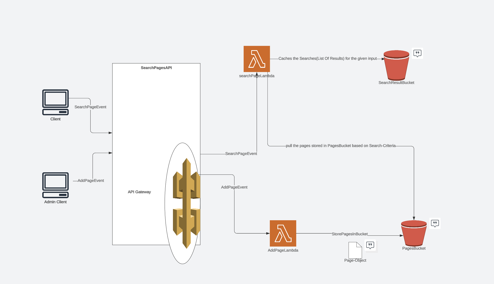

# search-pages
Purpose: Searching the Pages based on Total Available Page and Current index being visited and returns the List of Results based on MaximumNumber of Results thats been given in input

The function "retrievePages" will get 3 params from lambda
1. _currentPage_
2. _totalAvailablePages_
3. _maximumNumberOfPagesToDisplay_

and "retrievePages" returns list of string with Previous and Next appended based on currentPage.
The test cases are written in **Cucumber** as TDD test cases.
This **PageSearch Lambda** is deployed in AWS and can be tested from AWS console.
This Project is utilising the MVP approach where we do have basic functionality of returning results based on input.

Use below command to run test cases.
`mvn install
mvn test`

Future Iterations Post MVP we can add below capability to improve the performance:
**Iteration 1**: The **AWS Api-gateway** can be added to send event to PageSearchLambda through serverless and can be tested from http endpoints with right authroisation.
**Iteration 2**: **S3 Bucket** can be utilised as search storage to cache the search results which will avoid repeated calculation of result. The PageSearchLambnda will fetch the Result-json from bucket and check the availability of result by passing all input params before making any calculation, and sends the result from bucket if it find, otherwise the calculation made and save the searches back to Results-bucket.
**Iteration 3**: The **Client in React app** can be written and makes a call to Api-gateway to query the result. This can be tested with **Jest** as unit test platform and **cypress** as Integration testing.
**Iteration 4**: Adding the capability to have Admin-client to add new pages in system. Appropriate STRIDE model should be considered before injecting new content in system to mitigate the vulnerabilities.

Eloborating Iteration 4 here with below steps:
**Step1**: The another **S3 Bucket** called "PagesBucket" can be used to save the Page Object which has content of Page and SearchCriteria.
**Step2**: Adding new lambda called "AddPageLambda" which enables to save the Page Object which has content and SearchCriteria to above S3Bucket. Give the Role based permission to only Admin-Client to add any new pages.
**Step3**: Modify PageSearchLambda to pull the pages saved in "PagesBucket" and keep it as totalAvailablePages when doing caluclation of Results.
**Step4**: Hook the new lambda(AddPageLambda) to APIGateway and this can be tested with new endpoint.
**Step5**: Create new React app for Admin Client which calls new endpoint to add new pages.

So The Architecture of Future implementation should look like as below.

The demo of Lambda through console

